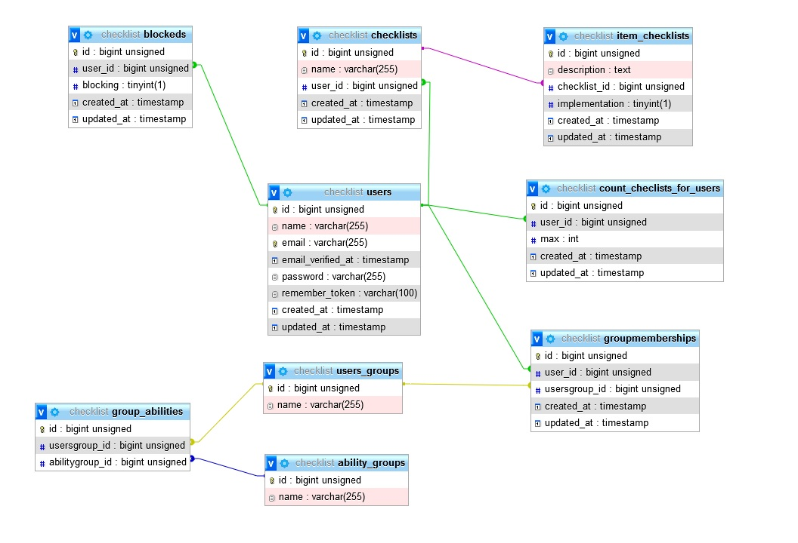

## About Laravel

# PHP-tasks (*Задачки по PHP*)

## Task

Задание на PHP с использованием

фреймворка (Yii2 или Laravel):
Необходимо реализовать сервис чек-листов:

1. Админка
- Управление админами с разграничением прав;
- Управление пользователями с возможностью
блокировки;
- Управление кол-вом возможных чек-листов у
пользователя (в зависимости от роли админа,
необходимо ограничивать данный функционал);
- Просмотр чек-листов.

2. Res-API (перечень методов которые необходимо
реализовать)
- Регистрация / Авторизация;
- Создать/Удалить чек лист (учитывать настройки
возможного кол-ва);
- Добавить/Удалить пункт в чек лист;
- Отметить выполнен/не выполнен пункт;
- Получить список чек листов;
- Получить список пунктов чек-листа с указанием
выполнен/не выполнен.
*/
Сдача задания: Ссылка на репозиторий, который содержит ваш проект
и README
- Фамилия Имя
- Тестовое задание на PHP
- Описание проекта
- Подготовительные действия (установки, настройки
и т.д) для успешной работы проекта
- Информация о доступах (логины/пароли и т.д.)
- Описание, как запустить ваш проект

## Окружение

PHP 8.0.14 (cli)
MySQL - 8.0.24
Laravel Framework 9.52.4

## Действия при запуске

Создать бд. Название при разработке было checklist

Настроить файл .env в части подключения к бд.

На локальном сервере разработки были такие:

DB_CONNECTION=mysql
DB_HOST=127.0.0.1
DB_PORT=3306
DB_DATABASE=checklist 
DB_USERNAME=root
DB_PASSWORD=

Выполнить миграции.

Запускать сидеры последовательно:
- UsersGroupsSeeder
- AbilityGroupsSeeder
- GroupAbilitiesSeeder
- GroupmembershipsSeeder

Создать клиента для доступа
php artisan passport:client --password

Для регистрации пользователей посылаем запросы по пути http://ваш сервер:ваш порт/api/register, значения name, email, password и c_password соответственно.
Логин по пути http://ваш сервер:ваш порт/oauth/token. Получаем токены (при регистрации или логине), используем из для авторизации при запросах.

## Условности

Я понял структуру пользователей из задания так:
Есть пользователи. У них после регистрации нет никаких прав доступа. Группа User (условное название) дает доступ для просмотра своеих чеклистов и их пунктов(я понял что приложение будет посылать запрос к api, и в запросе будет идти id пользователя, взятый у аутентифицированного пользователя, благодаря чему не потребуется вводить в api проверку у группы User на запрос "не своего" чеклиста).
Группа Moderator - просмотр чеклистов и их пунктов + установка на пунктах параметра выполнения их.
Группа Admin - вышеперечисленное + создание/удаление чеклистов и их пунктов.
Группа SuperAdmin - все вышеперечисленное + доступ административному web интерфейсу. "Захардкожено" в app\Http\Controllers\LoginController.php, строка 42.